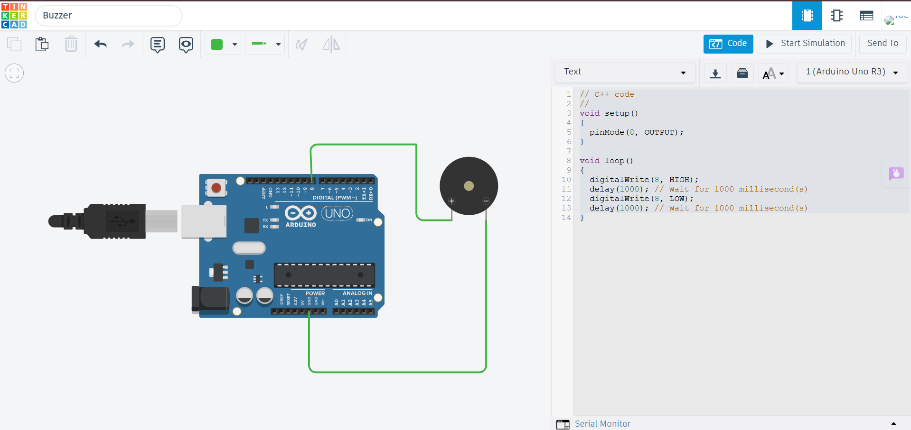

# Buzzer using Arduino Uno

## Description

This project demonstrates how to interface a buzzer with an Arduino Uno using Tinkercad. The Arduino controls the buzzer by sending digital signals, allowing it to generate beeps or alarm sounds for notifications and alerts.

## Components Required

- Arduino Uno
- Piezo Buzzer
- Jumper Wires

## Circuit Diagram



## Connections

| Buzzer | Arduino Uno |
|---------|-------------|
| Positive (+) | Digital Pin 8 |
| Negative (-) | GND |

> **Note:** If your code uses a different digital pin, update the table accordingly.

## Working

The Arduino sends a HIGH signal to the buzzer, causing it to produce a sound. When the pin is set to LOW, the buzzer stops. By controlling the timing of HIGH and LOW signals, different beep patterns can be generated.

## Output

The buzzer produces periodic beep sounds according to the Arduino program.

Example:

```
Beep...
Beep...
Beep...
```

## Applications

- Security Alarm Systems
- Doorbell Systems
- Warning Indicators
- Timer Alerts
- Home Automation Projects

## Files

- `buzzer.ino` – Arduino source code
- `circuit.png` – Tinkercad circuit screenshot