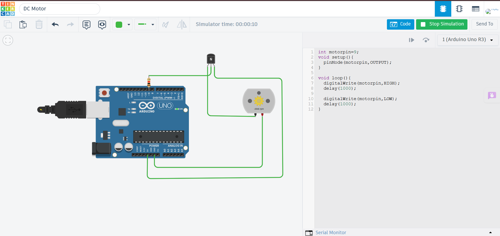

# DC Motor using Arduino Uno

## Description

This project demonstrates how to control a DC Motor using an Arduino Uno in Tinkercad. The Arduino switches the motor ON and OFF through a transistor or motor driver, allowing basic motor control.

## Components Required

- Arduino Uno
- DC Motor
- NPN Transistor (or Motor Driver)
- Flyback Diode
- External Power Supply (if required)
- Jumper Wires

## Circuit Diagram

## Connections

| Component | Arduino Uno |
|-----------|-------------|
| Motor Control | Digital Pin 9 |
| Motor Power | External Supply / 5V (simulation) |
| Ground | GND |

## Working

The Arduino sends a digital HIGH signal to the motor control circuit, allowing current to flow through the DC motor and causing it to rotate. Setting the output LOW stops the motor.

## Output

The motor rotates continuously while the control pin remains HIGH and stops when it becomes LOW.

## Applications

- Fans
- Robotic Vehicles
- Conveyor Systems
- Water Pumps
- Automation Projects

## Files

- `dc_motor.ino` – Arduino source code
- `circuit.png` – Tinkercad circuit screenshot