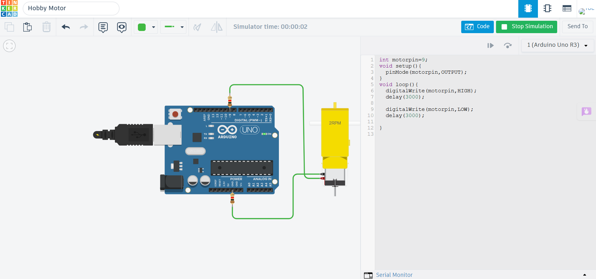

# Hobby Motor using Arduino Uno

## Description

This project demonstrates how to interface a Hobby Motor with an Arduino Uno using Tinkercad. The Arduino controls the motor through a switching circuit, enabling it to start and stop based on the program.

## Components Required

- Arduino Uno
- Hobby Motor
- NPN Transistor (or Motor Driver)
- Flyback Diode
- Jumper Wires

## Circuit Diagram

## Connections

| Hobby Motor | Arduino Uno |
|--------------|-------------|
| Control Pin | Digital Pin 9 |
| Power | 5V / External Supply |
| Ground | GND |

## Working

The Arduino controls the hobby motor by sending digital signals to the switching circuit. When the output is HIGH, the motor rotates. When the output is LOW, the motor stops.

## Output

The hobby motor starts and stops according to the Arduino program.

## Applications

- DIY Robotics
- Mini Fans
- Educational Projects
- Mechanical Demonstrations
- Automation Systems

## Files

- `hobby_motor.ino` – Arduino source code
- `circuit.png` – Tinkercad circuit screenshot