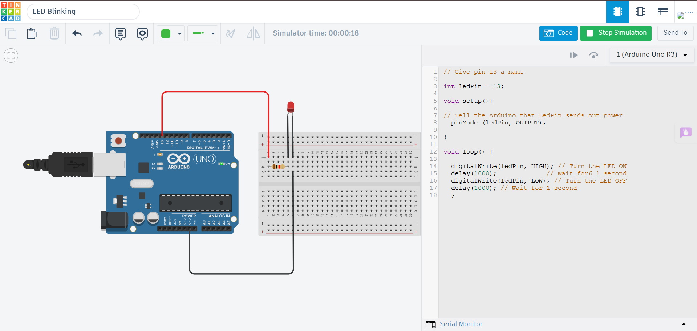

# LED Blinking using Arduino Uno

## Description

This project demonstrates how to blink an LED using an Arduino Uno in Tinkercad. The Arduino repeatedly turns the LED ON and OFF at regular intervals by sending HIGH and LOW signals to a digital output pin.

## Components Required

- Arduino Uno
- LED
- 220Ω Resistor
- Jumper Wires

## Circuit Diagram

## Connections

| Component | Arduino Uno |
|-----------|-------------|
| LED Anode (+) | Digital Pin 13 |
| LED Cathode (-) | 220Ω Resistor → GND |

## Working

The Arduino outputs HIGH to digital pin 13, allowing current to flow through the LED and causing it to glow. After a delay, the pin is set LOW, turning the LED OFF. This cycle repeats continuously, creating the blinking effect.

## Output

The LED blinks continuously with a fixed delay between ON and OFF states.

## Applications

- Status Indicators
- System Health Monitoring
- Alarm Indicators
- Learning Digital Output Control

## Files

- `led_blinking.ino` – Arduino source code
- `circuit.png` – Tinkercad circuit screenshot