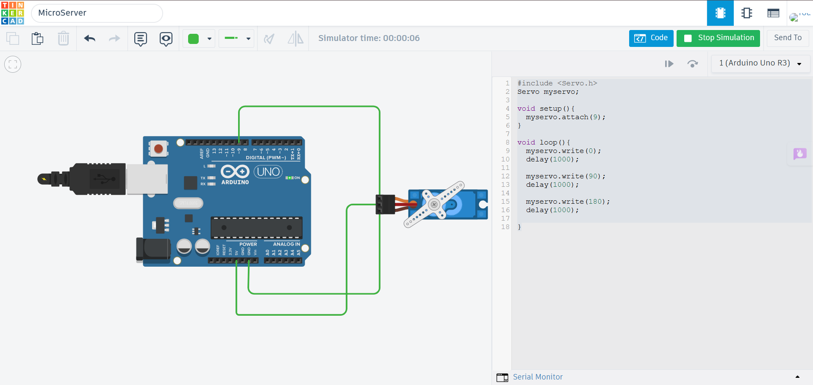

# Servo Motor using Arduino Uno

## Description

This project demonstrates how to control a Servo Motor using an Arduino Uno in Tinkercad. A servo motor can rotate to a specific angle based on control signals generated by the Arduino, making it suitable for precise position control applications.

## Components Required

- Arduino Uno
- Servo Motor
- Jumper Wires

## Circuit Diagram



## Connections

| Servo Motor | Arduino Uno |
|--------------|-------------|
| Red (VCC)    | 5V |
| Brown/Black (GND) | GND |
| Orange/Yellow (Signal) | Digital Pin 9 |

## Working

The Arduino uses the Servo library to generate PWM control signals. These signals rotate the servo shaft to a desired angle between 0° and 180°. The servo holds its position until a new angle is commanded.

## Output

The servo rotates smoothly between different angles as programmed.

Example:

```
0°
90°
180°
90°
0°
```

## Applications

- Robotic Arms
- Automatic Door Systems
- Camera Pan-Tilt Mechanisms
- Smart Locks
- Automation Projects

## Files

- `servo_motor.ino` – Arduino source code
- `circuit.png` – Tinkercad circuit screenshot